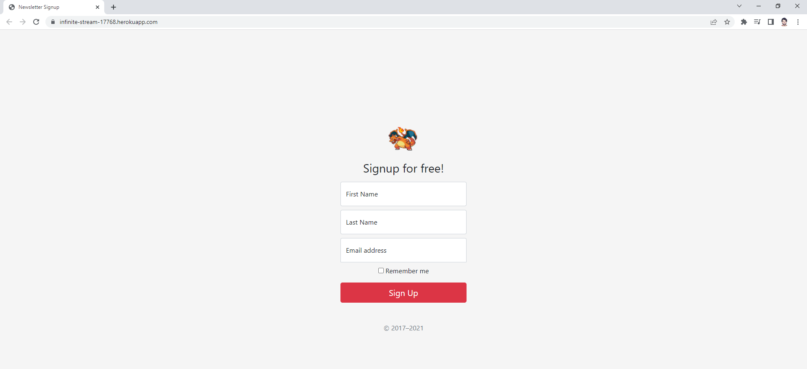

# NewsLetterWebSite
A newsletter web site deployed with Heroku running POST requests to mailchimp servers in the backend.

# References

- https://devcenter.heroku.com/articles/heroku-cli
- https://mailchimp.com/developer/
- https://expressjs.com/
- https://getbootstrap.com/docs/5.0/getting-started/introduction/
- https://getbootstrap.com/docs/4.5/components/jumbotron/